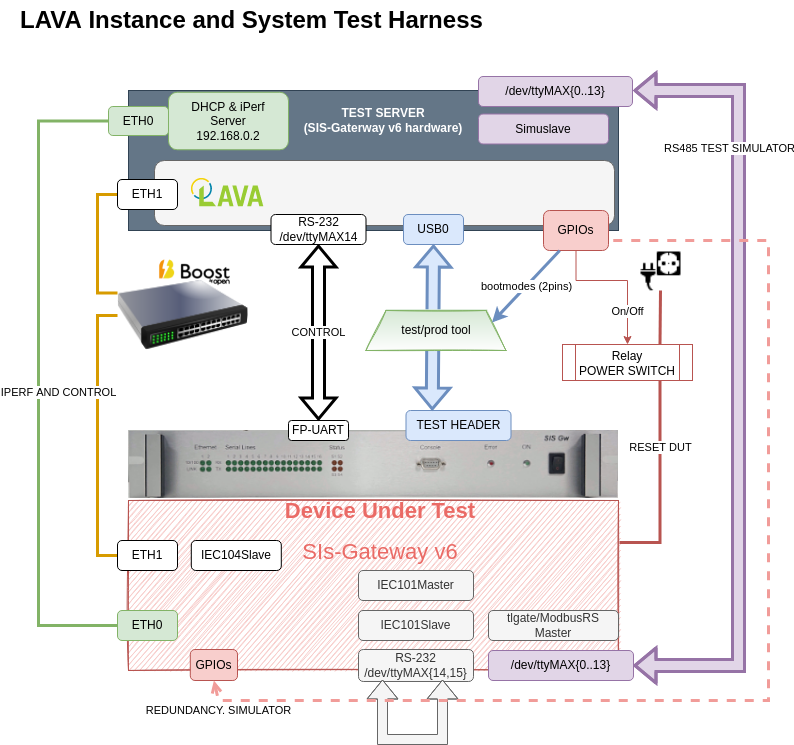

Continuous Integration
=======================

## Feature Status and References

| Technical Notes and Specification | Current [Maturity Grade](../01_development_methods/SEPASSRFNT-96-development.md)| Comments |
| :---: | :---: | --- |
|[SEPASSRFNT-41](https://jira.open-groupe.com/browse/SEPASSRFNT-41) | MG30 (18/12/21) | Concept |

## Introduction

Test types, and Actors are defined in the [**Test Strategy**](test-strategy.md) document, **please read it first if you haven't, so you share the same terminologies and definitions**.

We wish to use Continous Integration (CI), i.e. triggered build of integration artifact and project deliverables, and test of those deliverables againts Functional Tests (FT) and Integrations Tests (IT).

The CI infrastructure shall allows us to: 
* automate testing based on changes (gitlab commit triggers)
* monitor deliverables quality based on timer triggers (nightly builds)
* improve productivity for developers when testing, byt the use of pipelines (manually triggered build and tests plans)

The CI infrastructure must be simple and fully manageable by MAINTAINERS and DEVELOPERS, and must not required generic IT support to intervene.
It **must be reliable and secured over several years**, because it is the main tool of release qualification.

**A Software release is essentially the formal bundling and storing of a "good" nightly build, that also passes Acceptance Tests (AT).**

## CI Infrastructure Functions Definitions

* A "Build Plan" is a series of Steps, leading to the execution of any combinaation of the functions described in the following Sections.
* A "Trigger" is a "reasons" or event leading to the execution of a Build Plan.

The CI Infra must allow:
* Time triggers : Build Plan starts at a given hours.
* Manual triggers : Build Plan start when user requests it
* Cross Repository triggers : Build Plan starts whenever changes occur on a different repo in a specified branch.

### FUNCTION : Build
#### Images and Deliverables

| Image | Description | Triggers |
| --- | --- | --- |
| opengrp-gateway-img-dev | development image, used for nightly builds | nightly |
| opengrp-gateway-img-maint | maintenance image, used for production and rescue | when any related repo is changed, OR when PRODUCER wishes to release a new version |
| opengrp-gateway-img-emc-tests | specialized image, for EMC-tests | emc-testsuite repo is modified |
| opengrp-gateway-img-release | release image | maual : when PRODUCER decides to release an image, based on a (FT/IT)-qualified development image |

#### Software components

repo : all of the repositories under https://gitlab.boost.open.global/schneider-electric/passerelle_refonte/Software/bsp
trigger: any change to branch master, or manually if user wants to run UT/FT/IT tests.

#### Project Documentation

repo under https://gitlab.boost.open.global/schneider-electric/passerelle_refonte/Software/bsp/sisgateway-internal-documentation
trigger: any change to branch master, or manually if user wants to run UT/FT/IT tests, or upon release.

### FUNCTION : Deploy/Store Artifacts

Artifacts to be stored are:
* nightly reports (stored as test results in Boots)
* FT and IT reports **for all releases**
* Firmware Update Bundles (for **releases and last nightly only**)
* Flashables (wic(s), tiboot3, tispl, uboot) **for all releases)**
TBD (Sharepoint?)

### FUNCTION : Schedule Tests

* FT will be scheduled nightly, or based on commit or manual triggers, and run as "native" (PC-host) software
* IT tests (on target) are pushed as 'Jobs' by Boots (or Jenkins) onto LAVA, using a REST API, see LAVA documentation for examples.

### FUNCTION : Collect Results

* FT test results are parsed and collected by Boots (or Jenkins).
* The CI is able to vote up or down for a Pull Requests, based on the test result.

### FUNCTION : Dispatch Tests

* IT are dispatched on a physical target by the LAVA Dispatcher.

## CI Infrastructure Workflows

### FLOW: Software Package Contribution Validation

Each developer, once he is "happy" with a consistent contribution block, i.e. one or more correctly formed commits, is meant to create a PR to contribute his work.
The PR will trigger a native build of the contribution branch, and run the Functional Test (fT) suite for this component. If the FT fails, the PR should not be merged.
If the build and the FT succeed, the contributor must merge his work to "develop", and remove the contribution branch.

### FLOW: Software Integration Quality Monitoring

Every night, all contributions are tested as an integrated system : IT are run.
The tells is the current global state of the "develop" baseline, is suitable for branching to a release baseline "tlgate-vMM.mm".

### FLOW: Release and Qualification

Please make sure you've read the [Release Strategy (Q/A document)](../10_production_methods/release-strategy.md) first.

In a nutshell:
* when the software from a given baseline can be successfully built and tested for Integration Tests (IT), it can be tagged as a Release Candidate (RC).
* A Release requires a RC to be customer-qualified by running the Acceptance Tests (AT).

AT are run by a human operator, using real Modbus hardware slaves, and SCADA-like tools (modpoll).

We re-use a TLGate-v6 machine to run a LAVA instance, and host simuslave, DHCP (non-authoritative, only on ETH0) and iPerf server.

The Test/Production server is connected to the DUT thanks to the Test/Production tool, a small PCB with the required connectors, and an control header.

