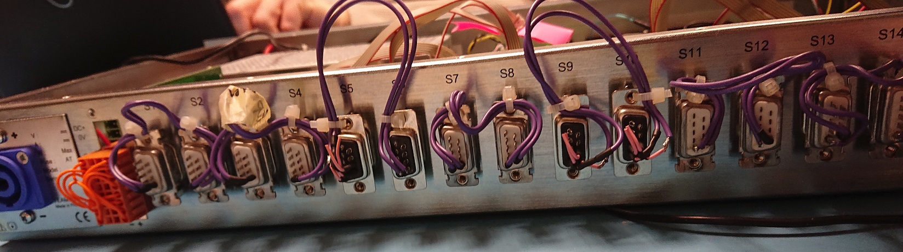

# EMC Testsuite

## Feature Status and References

| Technical Notes and Specification | Current [Maturity Grade](../01_development_methods/SEPASSRFNT-96-development.md)| Comments |
| :---: | :---: | --- |
|[SEPASSRFNT-65](https://jira.open-groupe.com/browse/SEPASSRFNT-65) | MG80 (18/12/21) | released |


## Feature Description and Domain of Application

This is the tes-suite that is to be used for Electromagnetic Compatibility Tests.

* in order to qualify Tlgate-v6 prototypes (RUN1, RUN2) versus **EMC**
* in order to test Tlgate-v6 prototypes (RUN1, RUN2) versus **robustness (long runs)**

## Requirements

* The testsuite shall test the sub-systems listed below, and also execise them unattended, so electromagnetic emissions can be measured.
* The testsuite shall stimulate the sus-systems at least to the extend of the real application software, under worst case (max load) scenario.

## Tested interfaces

the following interfaces are tested:

| Sub-system | test principle | test script |
| --- | -------- | ------ |
| CPU/PLLs | load with 'stress-ng' hogs | **emm-cpu-ddr** |
| DDR | run 'stress-ng' pattern checking | **emm-cpu-ddr** |
| eMMC | copy (read+write) compare, loop (limited to 100k loops) | **emm-emmc** |
| EEPROM (i2c) | read/write (magic is checked | **emm-i2c-eeprom** |
| GPIO Expander (i2c) | read/write/compare **requires a loopback dongle** | **emm-i2c-gpio** |
| RTC (i2c) | read/write | **emm-i2c-rtc** |
| IHM (leds) | toggle with timer or supported activity metrics | **emm-led-status** |
| QuadUARTs (spi) | echange and compare 128bytes between ttyMAX(2k)<->ttyMAX(2k+1) (ltp) | **emmc-spi-quad-uarts** |
| Ethernet Ports | run iperf3 client, doing bidir transfers of 10s in a loop | **emc-iperf3** |


## Usage

* The testsuite can be installed anyware on the target, preferably in **/home/root/emmc-testsuite**
* It is started with **start-all**
* It is stopped with CTRL+C in start-all, or direct call to **stop-all**

## Dependencies

### Software dependencies

* ltp (with tlgate specific tests)
* stress-ng
* gpio-tools

### Hardware dependencies

#### Hardware loopback dongles
* RS485 loopback dongle
* GPIO loopsback dongle



### Ethernet Test Server Configuration

#### Usage

```
Control PC (can be the RapsberryPi itself) ==========[ Ethernet SWITCH ]
                                                        ||  ||  ||
DHCP and iPerf server (Rapi-Pi)  ======================//   ||  ||
                                                            ||  ||
Device Under Test (DUT, a.k.a SISGateway v6) =|= PORT1 ====//   ||
                                              |                 ||
                                              \= PORT2 =========//

```

On the sisgateway DUT, script **emc-iperf3** can be launched. I will setup a bifirectionnal transfer, and do this in a loop (eahc pass is default 10s):

```
LD_LIBRARY_PATH=/usr/lib iperf3 -c 192.168.0.1 --bidir
```

#### Configuration
An external DHCP and iperf server is required, a RaspberryPi for instance.

The following packages and setup must be installed: 

* isc-dhcp-server
* iperf3
* tcpdump
* traceroute

In raspi-pi, /etc/dhcp/dhcpd.conf, we add: 

```
subnet 192.168.0.0 netmask 255.255.255.0 {
  range 192.168.0.10 192.168.0.100;
#  option routers rtr-239-0-1.example.org, rtr-239-0-2.example.org;
}
```
In raspi-pi /etc/defaults/isc-dhcp-server

```
INTERFACESv4="eth0"
```

Finally, we need to assign a static IP address to the serving IF: 

```
pi@raspberrypi:~ $ cat /etc/network/interfaces.d/eth0
# Static IP for the IF, as this is a DHCP server

# The primary network interface
allow-hotplug eth0
iface eth0 inet static
      address 192.168.0.1
      netmask 255.255.255.0
      gateway 192.168.0.1
```


[Back](toc.md)
