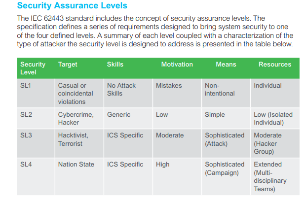
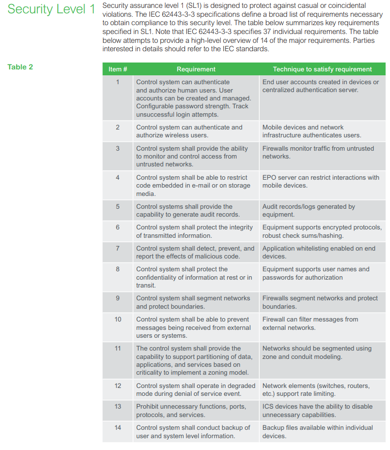

# Cyber Security Requirements

NOTE: For further design details, please also refer to [SEPASSRFNT-46](https://jira.open-groupe.com/browse/SEPASSRFNT-46)

**This product will undergo Schneider Electric cysec acceptance review, and must be ready to comply to IEC62443 Securiy Level 1 (SL1)**

## Cyser Security Management Plan

### CySec Governance Overview

Cybersecurity threat mitigation for embedded systems is best achieved by following a formal CySec Development Lifecycle, meaning that this should not be a late story or corrective action in the development cycle, but involves specification abd review at all steps of the development. In few words: a Formal Cyber Security Management Plan (**CSMP**) must be written, and complied to during the complete product lifecycle.

In the context of this project, because we are upgrading a former existing project with absolutely no CySec mitigation, we implement CySec in a "relaxed" way, following two principles:

1. Implement all common-sense features that are standard in any state-of-the-art low-security embedded product:
	* Users and Groups
	* firewall rules
	* dbus (IPCs) interfaces allow/deny rules
	* removal of all ports, protocol, interfaces that are not used

2. Insure that the Hardware and the Software do not prevent to achieve IEC-62443/SL1 compliance, if/when required by the customer, while we don't certify the product for this standard for now.
	* list and understand the practical requirements of the Standard
	* when possible implement them
	* if a substantial amount of development time is required for a given requirement, don't implement it, but clearly state how this could be done (not blocking points)

### CySec Reviews and Referents 

We do not plan specific reviews, and do not appoint any project referent, other than those already part of Open-Groups internal CySec Management Plan (RED?)

### CySec Updates and Threat Monitoring (CVE)

This process is not supported with SL1.

### Threat Model for SISGAteway

Based on the Microsoft Model:

#### Identification (STRIDE)

we try to map threats as follows

| Threat Type | General Principle | SISGateway Applicable interfaces |
| --- | --- | --- |
| **S**poofing |  authentication : pretend to be s/o else | Front Panel UART logging, Ethernet protocols, Modbus RS, IEC101 |
| **T**empering | integrity : change, make run your code | all of the above, plus internal interfaces : USB, JTAG. Hacking of eMMC, NVRAM |
| **R**epudiation | failure to adopt controls to properly track and log users' actions | all of the above |
| **I**nformation Disclosure | failure to protect private data like keys, peoples, or strategy data (business or security related) | website, documentation, filesystem |
| **D**enial of Service | failure to protect against exploits and spamming of interfaces and protocols, leading to lack of availability of some service | Ethernet protocols, UART-console |
| **E**levation of privilege | failure to prevent to gain Privileged Access through Credential exploitation, Vulnerabilities, Misconfiguration, Malware, Social engineering | all of the above |

#### Attacks on SISGateway

Based on STRIDE, we identify the following attacks. Note that we do not address Attacks that involve tempering with the hardware (unsolder parts, connect a JTAG probes etc...).

| Attack ID | Description |
| --- | --- |
| CYBER_ATK1 | logging as ROOT in rootfs |
| CYBER_ATK2 | logging as ROOT in maintenance |
| CYBER_ATK3 | HTTP attack, random program execution via CGI |
| CYBER_ATK4 | HTTP DoS requests spamming |
| CYBER_ATK5 | IEC104 exploits | 
| CYBER_ATK6 | IEC101 exploits |
| CYBER_ATK7 | Modbus RS exploits |
| CYBER_ATK8 | Intruding in u-boot |
| CYBER_ATK9 | USB mass storage mounting with harmful software |
| CYBER_ATK10 | Tempering with bootmodes |
| CYBER_ATK11 | Tempering with firmware-update bundles |
| CYBER_ATK12 | Loss of connectivity (DoS) through misconfiguration of the Network settings |

#### Ranking (DREAD)

* For simplicity, we assume users and groups are enforced, as in section "Users and Groups", we also assume that unused network protocols are filtered out using netfilter/iptables.

| Attack ID | **D**amage potential | **R**eproducibility | **E**xploitation (skill needed) | **A**ffected user | **D**iscoverability | |
| --- | ---------- | --- | ------ | ---------- | --- | --- |
| CYBER_ATK1 | this device: rootfs no longer bootable, total loss of functionality | easy | easy (social engineering) | OPERATOR (End-user), CONFIGURATOR | immediate | |
| CYBER_ATK2 | this device: total loss of functionality, device identity, and on-site recovery  | easy | easy (social engineering) | OPERATOR (End-user), CONFIGURATOR | immediate | |
| CYBER_ATK3 | this device: loss of web interface, misconfiguration | medium | medium | OPERATOR, CONFIGURATOR | variable | |
| CYBER_ATK4 | this device: loss of web interface reactivity, misconfiguration | easy | easy | OPERATOR, CONFIGURATOR, L3SUPPORT | variable | |
| CYBER_ATK5 | TBD | hard | high (specific) | OPERATOR (TDB) | TBD | |
| CYBER_ATK6 | TBD | hard | high (specific) | OPERATOR (TDB) | TBD | |
| CYBER_ATK7 | TBD | hard | high (specific) | OPERATOR (TDB) | TBD | |
| CYBER_ATK8 | this device: total loss of functionality, device identity, and on-site recovery | medium | medium | All Users | variable | |
| CYBER_ATK9 | this device: rootfs no longer bootable, total loss of functionality | medium | high (combine with other attacks to get privilege | OPERATOR, CONFIGURATOR | variable | |
| CYBER_ATK10 | this device: total loss of functionality, device identity, and on-site recovery | medium | medium (specific knowledge of the platform h/w and s/w) | All users | variable | |
| CYBER_ATK11 | this device: total loss of functionality | medium | medium (specific knowledge of the platform h/w and s/w) | All users | variable | |
| CYBER_ATK12 | this device: total loss of functionality | easy | easy | OPERATOR | immediate | |

### Applicable Normative Requirements

We only address Threads Ranked as **easy to reproduce, and requiring low skills** (human error), as per IEC-62443/SL1.

### SL1 Definition

SL1 matches involuntary attacks, performed by accident by an person not skilled in system hacking.

 

### SL1 Mitigations

The required mitigations are listed here:

## SISGateway Mitigation Specification

### Mitigation Matrix

| Attack ID | Mitigation ID(s) | Comment |
| --- | --- | --- |
| CYBER_ATK1 | CYBER_MGN1x | root is not a supported user |
| CYBER_ATK2 | CYBER_MGN1x, CYBER_MGN6x | User ROOT is not a supported user, u-boot access is protected |
| CYBER_ATK3 | CYBER_MGN5x | port 80 is no longer used, basic non default port mapping is done |
| CYBER_ATK4 | CYBER_MGN5x | - |
| CYBER_ATK5 | CYBER_MGN1.5 | TLGATE user will have restricted privileges |
| CYBER_ATK6 | CYBER_MGN1.5 | TLGATE user will have restricted privileges |
| CYBER_ATK7 | CYBER_MGN1.5 | TLGATE user will have restricted privileges |
| CYBER_ATK8 | CYBER_MGN6x | u-boot prompt is hidden and password protected. |
| CYBER_ATK11 | CYBER_MGN7x| bundles are checked for integrity |
| CYBER_ATK12 | CYBER_MGN8x | TODO : website can be password protected |

### Mitigation CYBER_MGN1x : Users and Groups management

Users to Create: 

| Mitigation ID| User Name |  Type | Description |
| ---| --- | --- | --- |
| CYBER_MGN1.1 | OPERATOR | Human | Someone on-site, an Integrator, or a End-User |
| CYBER_MGN1.2 | PRODUCTION | Non-Human |  Production PC user : Production Test Scripts, run by the production PC on End-Of-Line, or by the CI  |
| CYBER_MGN1.3 | L3SUPPORT | Human | A developer, such as a tlgate project engineer or prodict owner, providing support or someone acting   |
| CYBER_MGN1.4 | CONFIGURATOR | Non-Human |  User used by the COnfiguration Application  |
| CYBER_MGN1.5 | TLGATE | Non-Human |  User running the tlgate, IEC10x and sisgateway applications  |
### Mitigation CYBER_MGN2x : Firewall Rules

TODO

### Mitigation CYBER_MGN3x : DBUS allow/deny rules

TODO

### Mitigation CYBER_MGN4x : Rescue Console Environment Specification

see SEPASSRFNT-70 :  diag or rescue user can interact in front panel UART, but cannot be root and do anything
### Mitigation CYBER_MGN5x : HTTP Server Configuration

TODO

 * port 80 is no longer used, basic non default port mapping is done
 
 NOTE : SSL is not enforced, this is not part of IED-62443/SL1, we do not store certificates, CMS, privates keys, and do not need secure storage. However, should we need all this in the future, and in another product reusing this design, secure storage can be achieved using OP-TEE tursted apps and a dedicated eMMC partition. No secure element (dedicated hardware) is required.

### Mitigation CYBER_MGN6x : U-boot Console Access Configuration

TODO

### Mitigation CYBER_MGN7x : Firmware Update Bundles Athenticity and Integrity Checks

See [Firmware Update](../03_application_layer/SEPASSRFNT-18-update.md) in related section

Factory Reset allows to wipe any misconfiguration, and reinstate factory default, however, OPERATOR will be requiered to import and apply a valid configuration using Tlgate.exe. 

### Mitigation CYBER_MGN8x : WebSite/Configuration Protection

TODO ! do the basics first: prevent hacking the configuration using the setup inteface in the product!
### Modbus  and IEC10x Security Features

Not supported with SL1, would required to buy an update from Triangle Microworks, for about 40k$.

## References

* Introduction to Embedde Linux Security : https://embeddedbits.org/introduction-embedded-linux-security-part-1/
* IEC-62443 Practicalities : https://download.schneider-electric.com/files?p_enDocType=White+Paper&p_File_Name=998-20186845_GMA-US.pdf&p_Doc_Ref=998-20186845
* CGI bin vulnerabilities: https://www.loginsoft.com/blog/2018/07/25/introduction-to-common-gateway-interface-and-cgi-vulnerabilities/

[Back](toc.md)
