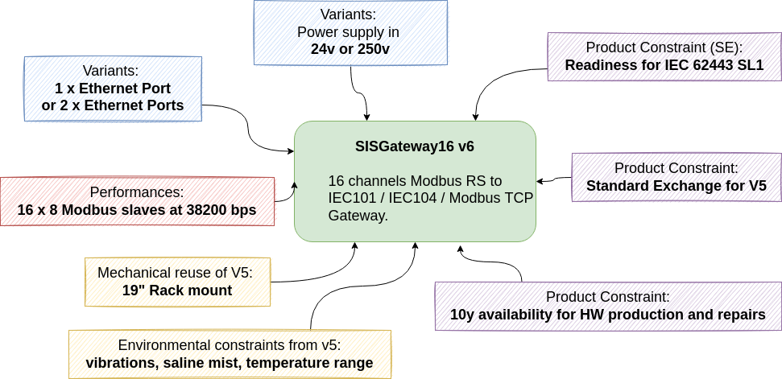
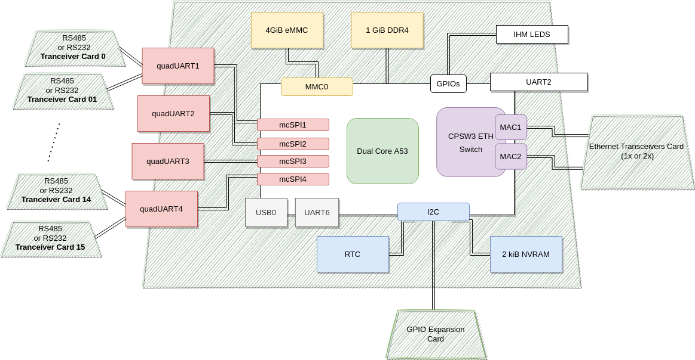
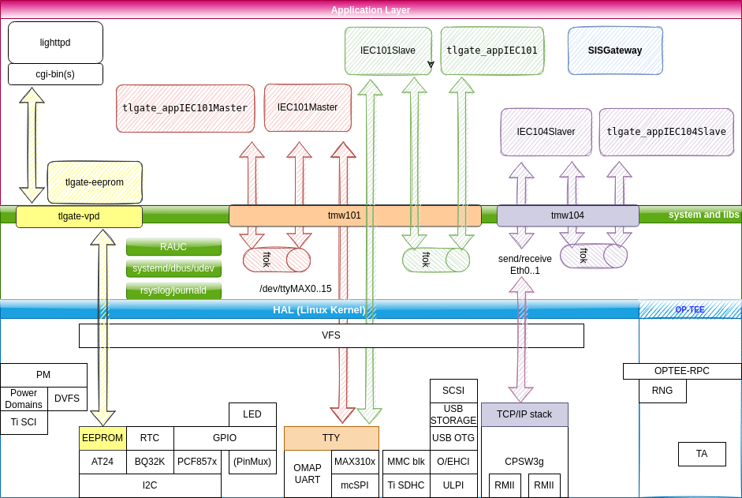

# Documentation for the SISGateway

**SISGateway is a Schneider Electric project rework from v5 (2004/2008) to v6 (2021)**

## Project Context

In a nutshell, this is a rework for stantard replacement of the now obsolete v5, hence the V5 documentation as for the system requirement also applies.

## Welcome

If you are new to the project, reading starts with:

* the 'Yocto build' chapter for practical hints on getting set up
* the various 'Developement Guidelines' for mandatory rules to contribute and release this software

## System Architecture Overview

### Hardware

### Software

## Documentation Rules

* This documentation is generated with the gitlab pipeline for GitBook. Select a chapter to start with in the frame on the left.
* This documentation is written as part of the developement process : a matching .md file is required for each HLF (high level feature, a.k.a Epics) upon delivery to MG60 (Maturity Grade 60)
* The developement process is described in [Developement Guidelines](01_development_methods/development.md), which you should read first.
