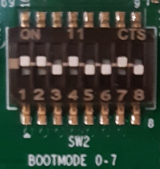

# Flashing using DFU

NOTE: For further design details, please also refer to [SEPASSRFNT-61](https://jira.open-groupe.com/browse/SEPASSRFNT-61)

# Using Device Firmware Upload (DFU)
Flashing is done through the USB port on the board. It allows loading all successive software parts: SPL, u-boot, then directly write to the eMMC.

Also see the [reference TI document](https://software-dl.ti.com/processor-sdk-linux/esd/AM64X/08_00_00_21/exports/docs/linux/Foundational_Components/U-Boot/UG-Memory.html).
Be careful with the SDK version which implies some important changes (need for sysfw.itb file or not, for example).

## Requirements on development machine
You need a successful Yocto build to get the images to be flashed, and the dfu-util tool. This tool can be installed in your Linux distribution if your package manager knows it already.
If not, you can get it built by Yocto with the command `bitbake dfu-util-native` and then run `build/arago-tmp-external-arm-glibc/deploy/tools/dfu-util`.

## Manual flashing

First, configure the boot mode. On the evaluation board, toggle SW2:

|SDCARD|USB|eMMC|
|:----:|:-:|:--:|
||||

On the TLGATE board:

|USB-Storage|USB-DFU|eMMC|
|:---------:|:-----:|:--:|
||||

Now when powering up the board, it enumerates on the USB bus.

**Note:** You may need to run dfu-util with root privileges to access the device (or better, create udev rules to relax access rights without running the whole procedure as root).

Then, based on the images built by Yocto and available in the `build/arago-tmp-external-arm-glibc/deploy/images/am64xx-tlgate` directory, on the PC:
```
$ dfu-util -R -a bootloader -D tiboot3.bin
$ dfu-util -R -a tispl.bin -D tispl.bin
$ dfu-util -R -a u-boot.img -D u-boot.img
```

Now you have a running u-boot with a command line. You may need to interrupt the bootloader (press a key when your read `Hit any key to stop autoboot`) if it has been already flashed in the past.

You need to configure eMMC registers and put u-boot in DFU mode:
```
=> mmc partconf 0 1 1 1
=> mmc bootbus 0 2 0 0
=> dfu 0 mmc 0
```

then flash the bootloader parts, back to the PC:
```
$ dfu-util -a tiboot3.bin.raw -D tiboot3.bin
$ dfu-util -a tispl.bin.raw -D tispl.bin
$ dfu-util -a u-boot.img.raw -D u-boot.img
```

and flash the whole image from the PC:
```
$ dfu-util -a rawemmc -D opengrp-gateway-img-dev-am64xx-tlgate.wic
```


You're done ! Move the DIP switches to *eMMC*, power off and on, and you should see the flashed OS booting.

## Debugging info

To check the USB connection, you can verify if the tool recognizes the device:
```
$ dfu-util -l
```

This command should list different IDs and devices depending on the step (ROM bootloader, SPL, u-boot, ...).

If you messed up u-boot environment, you can restore default with `env -f -a`.

# Differences between sd-card and eMMC
The wic image for sd-card is intended to be booted on the EVM only. It contains bootloader files in the /boot partition.

The wic image for eMMC is intended to be booted from eMMC, so it contains the kernel and device tree in the /boot partition, since the bootloader files are directly written to the mmcboot0 partition.

This difference is configured in the Yocto build through the `IMAGE_BOOT_FILES` variable defined for the tlgate DISTRO, which takes different values depending on MACHINE.

[Back](toc.md)
