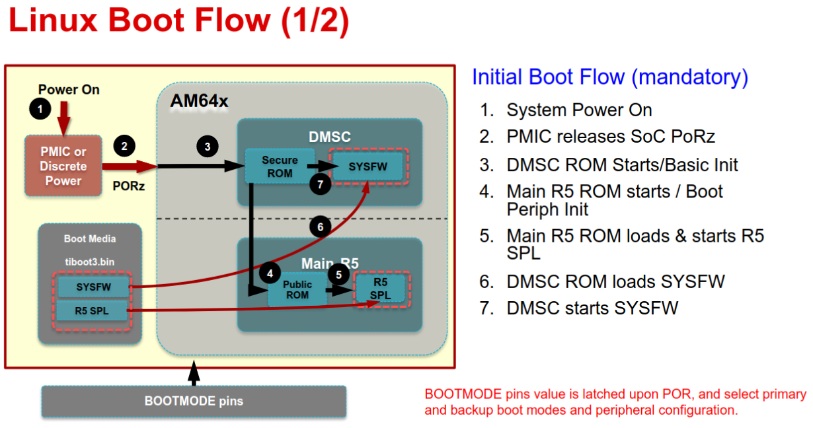
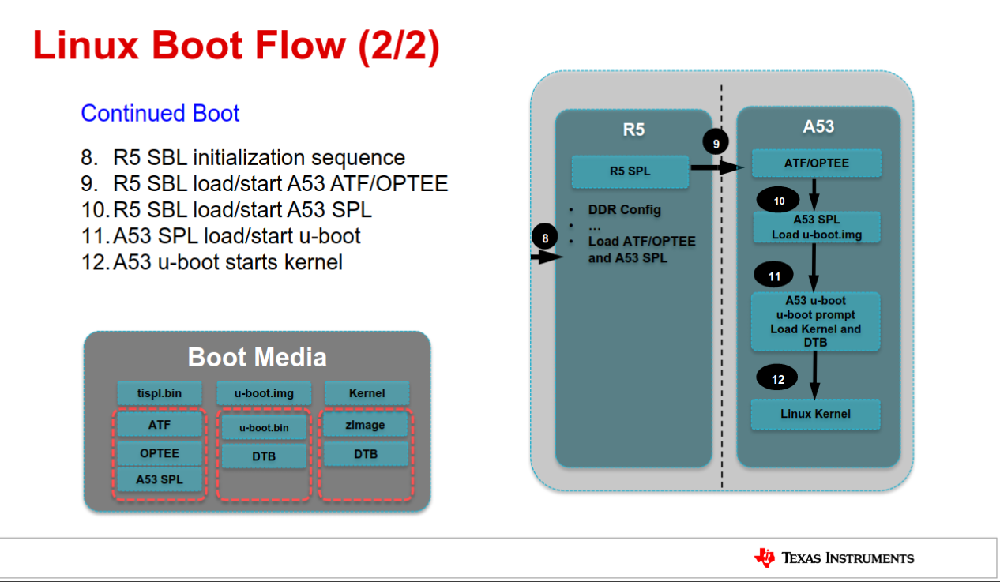

Bootmodes
==========

## On EVM and RUN1

EVM and RUN1 support full bootmodes selection, using DIP switches.

See https://www.ti.com/lit/an/spracy5/spracy5.pdf

## On RUN2

suported bootmodes will limited to:

* DFU (primary, alternative through change of resistors)
* Ethernet (primary, for production)
* eMMC (backup)

JTAG Debug Setup
=================

## Pre-resquisites

installed MCU SDK from https://www.ti.com/tool/download/MCU-PLUS-SDK-AM64X

## Tools Setup

* download Code COmposer Studio from https://www.ti.com/tool/download/CCSTUDIO
* install python3
* install CSS and reboot
* launch CSS, install updates (for sitara for instance)
* connect XDS200 on J25 on the eval board, or J21 on RUN1 (they have the same pinout)
* *The board needs to be in "no-boot" mode (See https://www.ti.com/lit/an/spracy5/spracy5.pdf) *

## Project Creation and Connection test

* in CCS, create a project for AM64x
* click on Test Connection, make sure the board is powered, and debug probe XDS200 USB is selected, should succeed.
* Click View -> Target Configurations
* select configuration, right-cliock and launch

 !(CSS launch target)[CSS-launch-target.png] 

* At this point,  the probe firmware could get updated 

##  Boot process overview

The image based boot process is as such : 

  

Step 1 to 7 can be achieved using the javascript script: 

```
loadJSFile /home/marc/ti/mcu_plus_sdk_am64x_08_01_00_36/tools/ccs_load/am64x_am243x/load.js
```

Path must be adapted to your installation, by editting the script.

However, this does not load the R5 SPL that will load tispl.bin based on the Bootmodes, this loads a custom init R5 application from the MCU SDK.

Hence, we need to manually install ATF/OPTEE and A53SPL as in tispl.bin, and start them.

  

## loading the A53 images or binaries

as per https://software-dl.ti.com/processor-sdk-linux/esd/docs/08_00_00_21/linux/Foundational_Components_ATF.html

```
   R5(U-Boot) --> TF-A BL31 --> BL32(OP-TEE) --> TF-A BL31 --> BL33(U-Boot) --> Linux
                                                       \
                                                   Optional direct to Linux boot
                                                           \
                                                             --> BL33(Linux)

Texas Instruments K3 SoCs contain an R5 processor used as the boot master, it
loads the needed images for A53 startup, because of this we do not need BL1 or
BL2 TF-A stages.

```

### Preload OP-TEE

* OPTEE : prebuilt image, load as "binary" using bl32.bin, at 0x9e800000

### Preload A53-SPL and U-BOOT

* A53-SPL : build and load "binary", or "elf" from spl/u-boot-spl-nodtb.bin, at 80080000
* A53-DTB : load binary from spl/dts/k3-am642-evm.dts, at 82000000

### Load and Start ARM Trusted Firmware

*  prebuilt binary, or built.
* if built, use http://git.ti.com/git/atf/arm-trusted-firmware.git branch ti-atf
* build with "make  PLAT=k3 TARGET_BOARD=generic SPD=opteed" (aarch64 bare toolchain)
* load address might not be a big deal, because of PIE build (start address is 0), so wee need to pick one that matches r5 spl, since this goes to SDRAM.
* load image at 0x701a0000
*  [^marc-0x701a0000-bl31.elf] is a rebased version of the elf, so that symols can be used

Conclusion on JTAG boot
========================

Full-JTAG boot seems problematic for production, since this will require a modified R5-SPL (or at least more investigation), and later some integration on a Production PC, using javascript scripting.

It seems more reasonnable to leverage the primary/secondary boot scheme : 


```
je pense qu'il est plus raisonnable d'utiliser le backup-bootmode pour la prod : si on peut confirmer/valider une séquence on pourra préconfigurer le RUN2 pour :
primary boot : eMMC
secondary boot: Eth/BOOTP
USB en host/storage. 

Draft sequence de flashing et tests de prod
==============================================

* step1) premiere sortie de reset : le boot eMMC échoue, la ROM bascule sur le backup (DFU ou encore mieux sur BOOTP)
* step2) le uboot "servi" déroule le flashing de l'eMMC puis le POST (test DDR et eMMC, et surtout UART2 par réponse du PC de prod), active la partition "recue/maintenance"  ("boot-b") et reboot si le POST est OK 
* step3) deuxieme sortie de reset : le boot eMMC sur la partition de maintenance se fait
* step4) le PC host de prod attend le prompt sur la console de debug (UART2) et execute la testsuite du BSP (/opt/ltp) , puis ecrit le rapport de test en EEPROM
* step4.1) si le test est OK : le PC de prod affecte les adresses MAC, PRODUCT TYPE et SERNUM via l'UART et écrit totu ca dans l'EEPROM
* step5) troisième sortie de reset : le boot eMMC boot sur la prochaine partition valide, c'est à dire la partition "application" (a.k.a. "boot-a") 
* step6) la config par défaut de TLGATE lance un rebouclage IEC101 (en cours de mise au point par Thierry) et un slave IEC104, l'opérateur de prod valide sur le PC de prod, que l'appli est fonctionnelle. Ca peut etre aussi automatisé s'il s'agit de la meme config que la CI.
La config finale, est comme toujours spécifique du client final, et faite via l'appli Windows de config (la passerelle sort de prod avec la config de Test Fonctionnel qui est la meme que celle de la CI) 

Il y a quelques briques techno à choisir pour la gestion du valid/invalid des partitions par exemple celle de barebox, comme chez Schneider/IOTB.
```

ANNEX: Various Notes and Details
=================================

## Boot flow

from ti-processor-sdk-linux-am64xx-evm-08.00.00.21/docs/linux/Foundational_Components/U-Boot/UG-General-Info.html

```
+------------------------------------------------------------------------+
|        DMSC            |         R5            |        ARM64          |
+------------------------------------------------------------------------+
|    +--------+          |                       |                       |
|    |  Reset |          |                       |                       |
|    +--------+          |                       |                       |
|         :              |                       |                       |
|    +--------+          |   +-----------+       |                       |
|    | *ROM*  |----------|-->| Reset rls |       |                       |
|    +--------+          |   +-----------+       |                       |
|    |        |          |         :             |                       |
|    |  ROM   |          |         :             |                       |
|    |services|          |         :             |                       |
|    |        |          |   +-------------+     |                       |
|    |        |          |   |  *R5 ROM*   |     |                       |
|    |        |          |   +-------------+     |                       |
|    |        |<---------|---|Load and auth|     |                       |
|    |        |          |   | tiboot3.bin |     |                       |
|    |        |          |   +-------------+     |                       |
|    |        |          |         :             |                       |
|    |        |          |         :             |                       |
|    |        |          |         :             |                       |
|    |        |          |   +-------------+     |                       |
|    |        |          |   |  *R5 SPL*   |     |                       |
|    |        |          |   +-------------+     |                       |
|    |        |          |   |    Load     |     |                       |
|    |        |          |   |  sysfw.itb  |     |                       |
|    | Start  |          |   +-------------+     |                       |
|    | System |<---------|---|    Start    |     |                       |
|    |Firmware|          |   |    SYSFW    |     |                       |
|    +--------+          |   +-------------+     |                       |
|        :               |   |             |     |                       |
|    +---------+         |   |   Load      |     |                       |
|    | *SYSFW* |         |   |   system    |     |                       |
|    +---------+         |   | Config data |     |                       |
|    |         |<--------|---|             |     |                       |
|    |         |         |   +-------------+     |                       |
|    |         |         |   |             |     |                       |
|    |         |         |   |    DDR      |     |                       |
|    |         |         |   |   config    |     |                       |
|    |         |         |   +-------------+     |                       |
|    |         |         |   |             |     |                       |
|    |         |<--------|---| Start A53   |     |                       |
|    |         |         |   |  and Reset  |     |                       |
|    |         |         |   +-------------+     |                       |
|    |         |         |                       |     +-----------+     |
|    |         |---------|-----------------------|---->| Reset rls |     |
|    |         |         |                       |     +-----------+     |
|    |  DMSC   |         |                       |          :            |
|    |Services |         |                       |     +-----------+     |
|    |         |<--------|-----------------------|---->|*ATF/OPTEE*|     |
|    |         |         |                       |     +-----------+     |
|    |         |         |                       |          :            |
|    |         |         |                       |     +-----------+     |
|    |         |<--------|-----------------------|---->| *A53 SPL* |     |
|    |         |         |                       |     +-----------+     |
|    |         |         |                       |     |   Load    |     |
|    |         |         |                       |     | u-boot.img|     |
|    |         |         |                       |     +-----------+     |
|    |         |         |                       |          :            |
|    |         |         |                       |     +-----------+     |
|    |         |<--------|-----------------------|---->| *U-Boot*  |     |
|    |         |         |                       |     +-----------+     |
|    |         |         |                       |     |  prompt   |     |
|    |         |         |                       |     +-----------+     |
|    +---------+         |                       |                       |
|                        |                       |                       |
+------------------------------------------------------------------------+
```

## Boot Filesoffset in eMMC

see file:///home/marc/ti-processor-sdk-linux-am64xx-evm-08.00.00.21/docs/linux/Foundational_Components/U-Boot/UG-Memory.html

* with eMMC, ROM and R5-SPL loaded files are location in the emmc-boot0 hardware partition, as in eMMC layout:

```
           boot0 partition (7 MB)                        user partition
   0x0+----------------------------------+      0x0+-------------------------+
      |     tiboot3.bin (512 KB)         |         |                         |
 0x400+----------------------------------+         |                         |
      |       tispl.bin (2 MB)           |         |                         |
0x1400+----------------------------------+         |        rootfs           |
      |       u-boot.img (4 MB)          |         |                         |
0x3400+----------------------------------+         |                         |
      |      environment (128 KB)        |         |                         |
0x3500+----------------------------------+         |                         |
      |   backup environment (128 KB)    |         |                         |
0x3600+----------------------------------+         +-------------------------+
```

* with SDCard and USB, they need all to be in the boot partition

```
IMAGE_BOOT_FILES_am64xx-evm = "${SPL_BINARY} tiboot3.bin u-boot.img uEnv.txt"
IMAGE_BOOT_FILES_am64xx-tlgate = "Image k3-am642-tlgate.dtb"
```


## R5 SRAM Layout during SPL boot stage

```
┌──────────────────────────────────────┐0x70000000
│                                      │
│                                      │
│                                      │
│    SPL IMAGE (Max size 1.5 MB)       │
│                                      │
│                                      │
│                                      │
├──────────────────────────────────────┤0x7017FFFF
│                                      │
│           SPL STACK                  │
│                                      │
├──────────────────────────────────────┤0x70192727
│          GLOBAL DATA(216 B)          │
├──────────────────────────────────────┤0x701927FF
│                                      │
│       INITIAL HEAP (32 KB)           │
│                                      │
├──────────────────────────────────────┤0x7019A7FF
│                                      │
│          BSS  (20 KB)                │
├──────────────────────────────────────┤0x7019F7FF
│         EEPROM DATA (2 KB)           │
├──────────────────────────────────────┤0x7019FFFF
│                                      │
│                                      │
│     UNALLOCATED AREA (123 KB)        │
│                                      │
│                                      │
├──────────────────────────────────────┤0x701BEBFB
│   BOOT PARAMETER INDEX TABLE (5124 B)│
├──────────────────────────────────────┤0x701BFFFF
│                                      │
│             TF-A (128 KB)            │
│                                      │
├──────────────────────────────────────┤0x701DFFFF
│                                      │
│      DMSC CODE AREA (128 KB)         │
│                                      │
└──────────────────────────────────────┘0x701FFFFF
```
